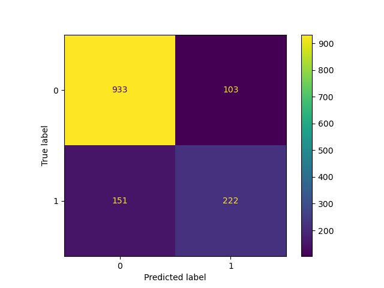
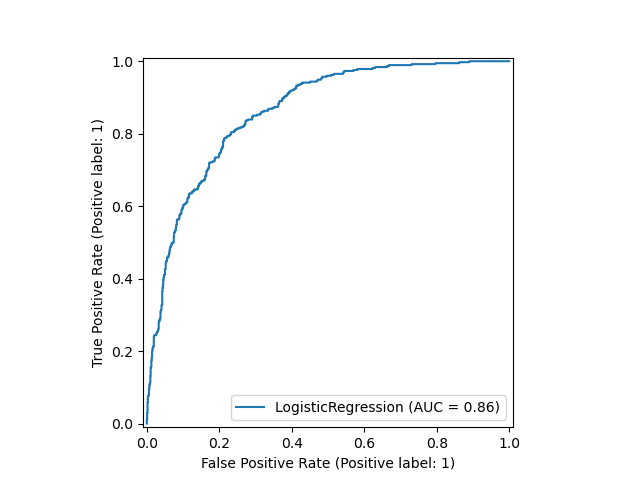

# 📊 Customer Churn Prediction using Machine Learning

  <b>End-to-End Machine Learning Project</b> 
  Logistic Regression • Model Evaluation • Business Insights

---

## 📌 Project Overview

Customer churn is a critical problem in the telecom industry.  
This project builds a machine learning model to predict whether a customer will churn based on behavioral and service features.

The goal is to help businesses proactively retain high-risk customers.

---

## 🗂 Dataset

- Telco Customer Churn Dataset
- 7,043 customers
- 30 engineered features after preprocessing

---

## ⚙️ Project Workflow

1. Data Cleaning
2. Handling Missing Values
3. Feature Encoding
4. Train-Test Split
5. Feature Scaling
6. Logistic Regression Model
7. Model Evaluation
8. Feature Importance Analysis

---

## 📈 Model Performance

| Metric | Score |
|--------|-------|
| Accuracy | **82%** |
| ROC-AUC | **0.86** |
| Recall (Churn) | **60%** |
| Precision (Churn) | **68%** |

---

## 🔍 Confusion Matrix

  

---

## 📉 ROC Curve

  

---

## 🧠 Key Business Insights

- 📌 Customers with longer tenure are significantly less likely to churn.
- 📌 Month-to-month contracts increase churn probability.
- 📌 Fiber optic internet users show higher churn rates.
- 📌 Security and Tech Support services reduce churn.
- 📌 Two-year contracts strongly improve customer retention.

---

## 💡 Business Recommendations

- Offer discounts for long-term contracts
- Improve onboarding experience (first 3 months critical)
- Bundle security and support services
- Improve fiber service satisfaction

---

## 🛠 Tech Stack

- Python
- Pandas
- NumPy
- Scikit-learn
- Matplotlib
- Seaborn
- Jupyter Notebook

---

## 📂 Repository Structure
Customer-Churn-Prediction-ML

│

├── Customer_Churn_Model.ipynb

├── images/

│ ├── confusion_matrix.png

│ ├── roc_curve.png

├── README.md

---

## 🎯 Future Improvements

- Random Forest & XGBoost comparison
- Hyperparameter tuning
- SMOTE for class imbalance
- Streamlit deployment

---

## 👤 Author

Mohammed Hashim  
Machine Learning Enthusiast 🚀
